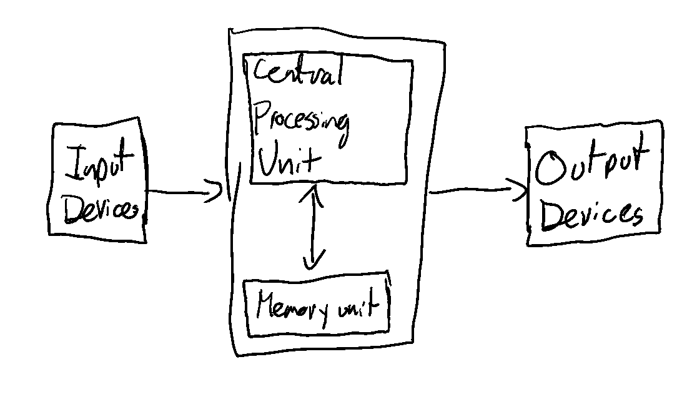
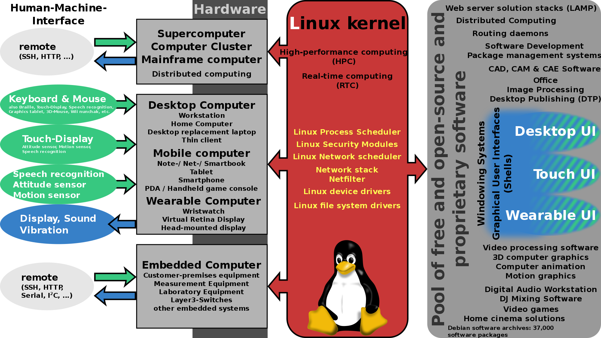

# Week 2 - Linux Basics

Welcome! This week, we'll go over some of the basics of Linux, what the purpose of an
OS is, and just how to get around. Feel free to play around with the terminal and look
up things online as you discover them!

Each exercise in this section will introduce you to different concepts that should get
you moving around comfortably in Linux, and understanding what an OS does on your
computer, at a surface level.

## Setup

For this course, you'll need a Linux installation. If you use Linux already, all you'll
need is to open a Linux terminal and we can get started. If you don't, we'll use a
docker image we've prepared for this course. Follow the appropriate
[installation tutorial](https://docs.docker.com/engine/install/), and then just run:

```
$ docker run -it pementorship/centos_interactive
```

You can also build the images yourself, using the docker images in the `images/`
folder of this repo.

We recommend you use the docker images for this whole course, as that will ensure you
have a consistent experience.

## Introduction: What's an OS?

Let's think about what your standard computer looks like. When computers were designed,
there was a simple model, often called the von Neuman architecture:



Think of a computer as a machine that takes in input from the outside world (e.g. from
the mouse, keyboard, camera, incoming network packets, etc.) stores that data,
processes it, and turns it into output (e.g. via the screen, speakers, outgoing network
packages, etc.). However, this model can be a bit complicated if you're doing things
like writing and running your code on the machine. How do you run more than one program
at a time? Does this mean you have to re-implement the hardware instructions for
working with a hard drive any time you need to access data there? Say you manage to get
multiple programs running. How do you get access to these resources to work neatly
across programs? Finally, how do you make sure programs don't modify or affect each
other? It would be really easy to write malicious code that just writes to the files
and memory that another program is using.

These are all questions that an operating system tries to answer. They provide an
abstraction layer for your programs to run on top of, as well as libraries, utilities,
and standard interfaces to do things like access hardware or other outside resources,
box off running programs, and share data safely between them.

### How does Linux provide these abstractions?

We'll be talking about abstractions for the next 10-ish weeks. There's a lot of
different mechanisms for this, and every OS does this slightly differently, so we'll be
focusing on Linux for this course. Note that most of these mechanisms generally apply
to other OS' as well, but the specifics will refer to Linux.

Linux is composed of two parts; the kernel and the user-space abstractions. The kernel
is the part that contains the meat of the OS, it is what performs all the privileged
operations. It's the one managing which programs to schedule when, what accesses
hardware devices directly, and the one that manages things like memory, the filesystem,
process management and "sandboxing", and most of the network stack. We'll dig further
into these in later modules, but this diagram contains some details:



One key question that often I've seen a lot of candidates stumble with is, why couldn't
you implement a program on the user-side that does all the operations of the kernel by
itself? This is a question we'll be able to make clearer as we go on, but in summary,
your CPU can run in different modes with different permissions, two of which are chosen
as user and kernel mode. The later can interact with hardware directly, access the
whole of memory, and change things like interrupts, scheduling, and pre-empts, while
the former can't. We'll talk about how that's implemented practically in later modules,
but for now, keep that separation in mind.

Ok, now let's jump to the exercises! This week's work is relatively light, we'll talk
about how to navigate a Linux shell (using bash), and some of the basic concepts and
commands you'll need.

## What's next?

Open `ex_1.pdf`, which will guide you through how to work with a Linux terminal. After
you're done, go to `problems.pdf` for open-ended problems to discuss with your mentor!
