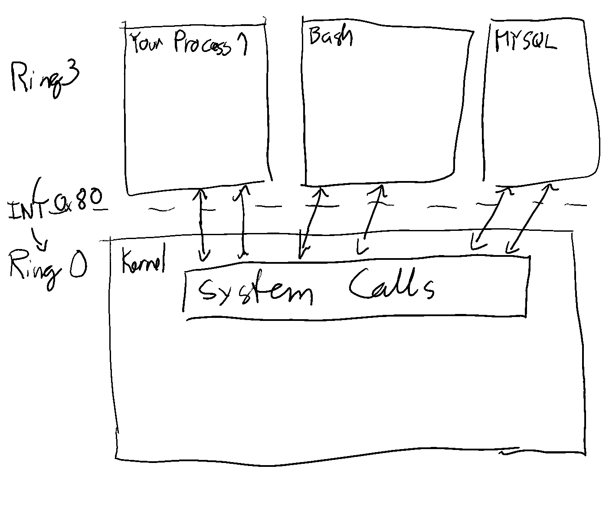

# Week 3 - System Calls

Welcome to week 2! This week we'll be talking about system calls, also known as
syscalls. This is the main interface your programs use to interface with your OS, and
they can provide a lot of very valuable information about what your programs are doing.
Without them they're just a black box that doesn't provide any input or output to the
outside world. Here we'll go over why they exist, how they work, and some examples.
Let's get started!

## The process abstraction

As we talked about last week, the OS is in charge of managing access to hardware, and
actually perform hardware-level operations. These devices include things like the hard
drive, network card, the USB ports (which could have things like a mouse, keyboard,
camera, etc. connected to it), audio input and output, GPU's, among many, many others.
However, the OS has to ensure that your programs can't access these things directly,
and so it provides a very basic abstraction: the process.

The process abstraction basically is a way your OS lets you encapsulate your programs.
It gives you a work area where, as far as your program can tell, you have access to the
whole of contiguous memory, every possible address out there, and it makes it look like
it's all owned only by your process. It makes it seem like you have full control over
what's being processed on this part of your system. These programs all run in what we
like to call "user mode". This means that a lot of features and instructions you'd be
able to use on your CPU from the kernel are completely inaccesible here (things like
direct hardware access, modifying memory, setting up and modifying interrupts, etc.).

You might wonder, why do we want this? Well there's a couple advantages this gives us:

1. **Isolation**: Every process on your system cannot affect any other process (except
   via well defined channels, more on that later).
2. **Reality-abstraction**: Real-life constraints are messy. Physical memory runs out,
   changes from machine to machine, processes get pre-empted. The memory and CPU
   abstractions allow us to ignore these limitations, pretenging we have infinite
   memory and access to CPU when we write the program, and we can let the OS figure out
   how to provide that for us.
3. **No direct HW access**: This is the most important one. Hardware access needs to be
   coordinated between the different processes. For example, you need to pick where to
   point an HDD's spindle to read a sector. You could leave this coordination up to
   each process through some sort of library and let the user programs send commands
   straight to the HDD. However, this would let a program affect and interrupt other
   programs, so instead the OS just takes away this ability all together.

### Note on CPU rings

One question that often comes up, is how does the OS block access to certain CPU
instructions? After all, couldn't you just put the right thing in your program and it
would access the hard drive without your OS knowing? Indeed, you can do a lot of things
without your OS ever finding out. However, most modern OS' make use of a feature
provided by most modern CPU's: protection rings.

You can read more about them [here](https://en.wikipedia.org/wiki/Protection_ring), but
in summary, most CPU's provide multiple "modes" you can run in, with different
restrictions in each mode. Each mode lets you run different instructions, and only the
more privileged modes will let you access hardware, modify memory, etc. On boot, your
OS will start out in the highest privilege, and setup everything so that, whenever it
launches new processes, they execute in the lowest privilege possible. As such, the
kernel itself always runs code in the highest privilege.

Notice this is different from the concept of "running as root". Even root programs run
in that lowest privilege ring.

## Interfacing with the kernel

One thing you'll notice in the process abstraction is that, by itself, it shouldn't let
you get anything done. You can't access your hardware, you can't read and write to disk
(or files in general for that matter), and you can't even write to the terminal.
However, as we saw last week, you can run plenty of programs in linux that do all these
things even though all those programs are running as these sandboxed processes. How
come?

Simple: system calls. System calls (or syscalls) are a mechanism that Linux (and most
other operating systems) provide for interfacing with the kernel. They're basically
special functions that will let you pass information down to the kernel and ask it to
execute a well defined operation. They include operations like `open()` for openning a
file, `read()` for reading a number of bytes out of an open file, `fork()` for creating
a copy of the current process into a new one, `stat()` to get metadata on a file,
`kill()` for sending signals to another process (some of which can kill them), etc.
There's a huge set of system calls, but we'll focus for this module on understanding
how they work at a high level, and we'll use some of the basic file manipulation
syscalls.

## Continuing...

We'll go into more details about how syscalls work and some implementation details in
the exercises. Each exercise will have its own image, much like in the last week's
problems. Go through each exercise PDF in order (titled `ex_1.pdf`, `ex_2.pdf`, and so
on), and then take a look at the problems pdf (`problems.pdf`) for open-ended problems
to apply what you learned.
