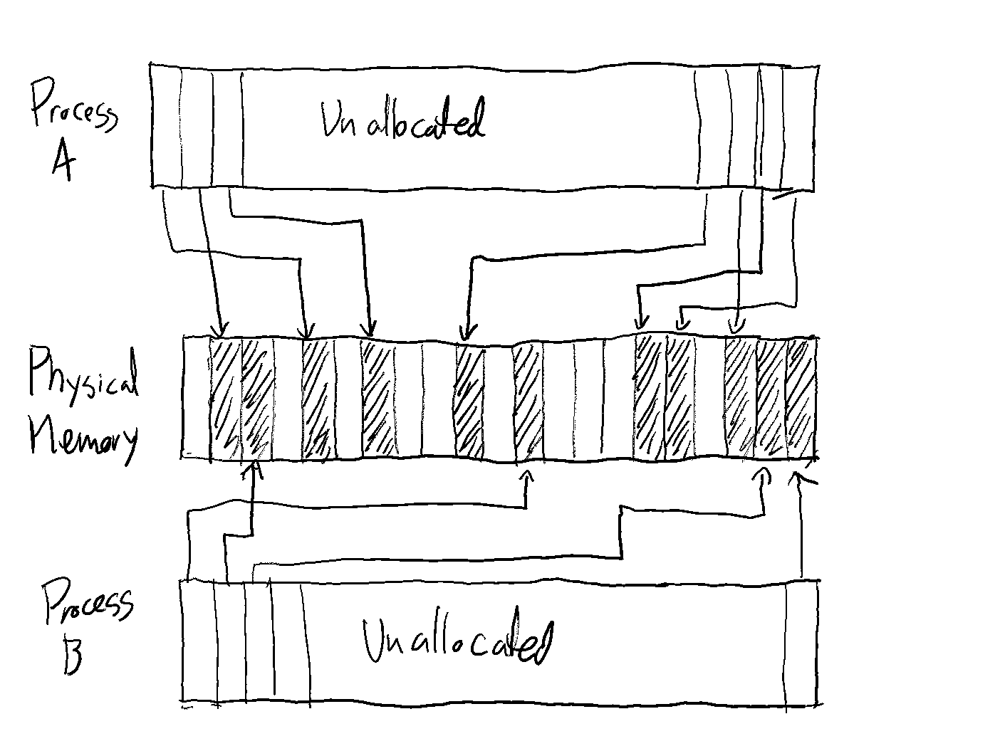

# Week 5: Memory

Memory is probably one of the most complex topics in modern operating systems. We could
take weeks talking about this. This week we'll try and go over a reduced form of the
problem, and look at the basics. We'll be referencing the book "Computer Systems: A
Programmer's Perspective". I highly encourage you to buy a copy for yourself if systems
and Linux are something you're interested in. This book gave me a unique perspective on
how computers work that I wouldn't have gotten elsewhere. However, if this is outside
your budget, you can find
[this link](https://github.com/smellslikekeenspirit/an-askreddit-list-of-compsci-books/blob/master/Randal%20E.%20Bryant%2C%20David%20R.%20O%E2%80%99Hallaron%20-%20Computer%20Systems.%20A%20Programmer%E2%80%99s%20Perspective%20%5B3rd%20ed.%5D%20%282016%2C%20Pearson%29.pdf)
which we'll never speak of again. We'll be talking about chapters 6, and mostly 9
(respectively about the memory hierarchy and virtual memory).

## Why memory?

Main memory is one of the most important parts of a computer system. As we mentioned in
a previous week, you can think of a computer as a machine that takes in input and
information in main memory and both generates output and changes it's current state
based on some rules (again, a
[von Neumann Architecture](https://en.wikipedia.org/wiki/Von_Neumann_architecture)). As
such, main memory is the source of all data in such a machine. That's were we hold
pertinent data for a process, variables in your program, caches, large computation
results, any data that your computer uses that's not a file on disk lives in main
memory. We often reffer to this memory as RAM memory, or, redundandly, Random-Access
Memory, as it can be addressed randomly at (mostly) equal speed, regardless of where
you access it.

As such, anything that works and manges main memory needs to be blazing fast and
efficient, since the time it takes to fetch data from main memory can be the main
bottleneck of your program. Often, the OS keeps these requirements by handing over
control to the CPU, that does a lot of the heavy work when accessing and writing to
memory, with the kernel acting as a manager, that only steps in when the memory layout
needs to change. Let's take a look at what that looks like:

## The problem

As we established in earlier weeks, an OS has a responsability of providing
abstractions. The key abstraction we'll focus on is the process abstraction. There's
three basic "illusions" the linux kernel provides to processes: infinite share of the
CPU, unlimited access to resources, and access to all $2^{64}$ bytes of addressable
memory (or, due to CPU limitations, more like $2^{48}$ bytes). Even on the smaller
limit I provided, that's still ~281 TB of addressable memory. That's a lot more than
your computer has (remember, this is RAM memory, not the space on your hard drive or
SSD, though you almost certainly still don't have that much storage). So how does the
kernel provide that much memory? Well, the key here is it doesn't. It just gives you
the full address space and then allocates chunks of memory as you need them.

## Allocation Techniques

Before we look at how we actually implement this in the kernel, and how it gets that
abstraction to work, let's talk a little about how memory allocation happens. This is
one of the most complex topics in Linux, but we'll distill it down to the most
important component: how do you hand out memory? This is a classic problem in Computer
Science, and a great example of the kinds of trade-offs you might find yourself doing
when desigining systems.

Now, I recommend you take some time to think about what different designs could exist
out there. How would you design memory mappings if you were doing them from scratch?
What are some bad designs? What puts too much weight on the CPU and what puts too much
weight on the kernel to manage?

The solution we have today, involves paging. Paging is basically the concept of
splitting the whole of memory into equal-sized chunks. Each time your process needs
more memory, it'll get some whole number of pages. That way, the kernel and CPU only
need to think about whole pages.

The size of the pages have to be chosen to both be small enough to make sure we don't
waste too much memory by requesting more memory than we need, but also large enough
that the mappings between process memory and physical memory aren't absolutely huge.
The standard size that generally achieves this trade-off well is 4 KB. This value is,
of course, configurable.

You might imagine one such allocation might look like this:

## CPU Implementation

### Page tables

Now, one of the most interesting things to note here is how this is all implemented at
the CPU and kernel level. As we've said, it's extremely important for memory access and
modification to still be blazing fast. Asking the kernel to look up the mappings every
time would be way too slow, so instead we let the CPU know where the mappings are, and
the kernel just keeps them up to date. These mappings are often refered to as the page
tables.

How do they work? It's quite simple. Picture your standard 32-bit address (this also
works in 64-bits, but we'll talk about 32-bits for simplicity). Each byte in "virtual"
memory can be uniquely identified by a given 32-bit number. You can lay out all of that
virtual memory and sequentially identify every byte in it using these addresses, with
each allocated page in the virtual memory space mapping to a page in physical memory:

](virtual_memory_physical.png)

Since the pages are a fixed size, which is a power of two (4 KB = 4096, or $2^{12}$),
you can split of the last 12 bit of the address as the address within a page, and use
the other 20 bits to define the address of the "virual page". However, if we mapped
all those pages in one massive table, we'd have $2^{20} = 1048576$ page entries, which
is too high. Why too high? Well, if the page table entries were even as small as a
4-byte integer, the table would be 4 MB per process. This could baloon very quickly on
a system with a lot of processes, and most of the entries would be empty. Not a great
use of space.

You might wonder, why do we need to have a table with every single one? Because that
way, we'd have very efficient lookup, we could just chop off the first 20 bits of the
address and use that as the index in the table.

Instead of doing this, we can use a nested structure. We split up those 20 bits
further, and use each segment as as index into a table, which points to another table.
This gives us the advantage that if, at any point, any of those segments don't contain
any allocated tables, we don't need to allocate the subtables, and thus saving a lot of
potential space. Let's look at a diagram to help make this clearer:

](nested_page_tables.png)

### The TLB

An interesting fact of the page tables is they live in, well, main memory, at a fixed
location as defined by a special register in your CPU (CR3 for c86). However, this can
still be very slow to access, since if we needed to fetch any piece of memory, we would
have to do two round trips to main memory, one for the page table entry, and once more
for the actual memory we're looking. This is particularly useless since most accesses
will be for a piece of memory we've requested (look at the
[80/20 rule](https://en.wikipedia.org/wiki/Pareto_principle) and the
[power law](https://en.wikipedia.org/wiki/Power_law) more generally).

How do we solve this? Well, the same way we solve most problems in systems: we add a
cache! That cache is the TLB, or Translation lookaside buffer. This is a component of
the CPU's memory management unit (MMU) that provides a cache of relevant page table
entries. There's a lot of different designs, cache eviction, and cache fill techiques
used by different CPU's. However, the important thing to note here, is that if the
entry cannot be found in the TLB, the MMU will have to go to the location of the page
tables, walk the nested structure, and fetch the appropriate page table entry.

### Page Faults

Often times, the CPU will walk the page table and it won't find any page table entries
associated with this particular virtual address. This will result in the CPU throwing
a page fault. Page faults are just the CPU telling the kernel it couldn't find a page
for an address requested, and it's asking the OS to figure out what to do with this.
There's two things that can happen: either a new page just needs to be allocated, or
the user program tried to access a page that it shouldn't be touching. On the former,
what happens is relatively simple. A physical page is allocated, mapped to this virtual
page address, and the CPU is told to continue operation normally.

The later is where things get interesting. If a page shouldn't have been mapped, the
kernel needs to tell the process it went outside the allocated memory, and kill it to
stop it from doing something harmful. It will throw one of two errors: a segmentation
fault (informed to the process using the `SIGSEGV` signal), or a bus error (informed to
the process using the `SIGBUS` signal). In modern Linux, most memory errors show up as
segmentation faults, which is likely what you've seen when you've tried to dereference
a pointer to `NULL`.

## The memory hierarchy and CPU caches

As we said early on in this module, memory speed can be one of the main bottlenecks in
any of the programs you run. Your registers are often 100x times faster to access than
main memory, which in turn is orders of magnitude faster than accessing something like
a disk, or a network resource. As such, many people who work on systems, like to think
about memory speed in terms of the memory hierarchy:

There's two interesting things to note here: as you go down in the chart, not only does
memory get slower, but it also gets bigger. This is no accident, as it's cheaper to
make a lot of slow memory than it is to make fast memory. There's also more space to
put it in if it doesn't have to be as fast. It also is to take advantage of power law
dynamics, keeping things that are accessed often closer and faster to the CPU.

The second thing you'll notice, is there's a level between registers and random access
memory. That's your CPU caches. These are often the most important parts of your system
when determining the speed of access. This is what really can throw big-O notation out
the window. Algorithms that look like they're linear, if they make bad use of the
cache, can perform much worse than other, suposedly worse linear or quadratic
algorithms.

So, how does it work? Well, these caches take advantage of the virtual memory addresses
and act as huge tables. They split up virtual addresses into segments and store a
subset of memory locally.

Let's look at a practical example. Let's say that we have a cache that stores segments
of 256 bytes of memory (or $2^8$ bytes). That means that it'll use $32-8=24$ bytes to
identify each segment of memory it saves. Any time a read or a write goes through the
cache, it'll check if the upper 24 bytes match any of the cached values. If it does,
then it just returns the value. If it doesn't, then it'll go to the next cache, and
repeat the process, or if this is the last cache, it'll go all the way to main memory.
On the way back, it'll potentially populate the cache by saving the 256 bits to the
cache line that it fits in.

How does it know where to fit it in? Well, the cache will only consider a certain
number of bits in the address to actually identify where it fits in the cache. Let's
imagine out of those 24 upper bytes, it uses only the lower 10 bytes to identify which
cache "line" to send this to. This means that we'd have $2^{10}=1024$ cache lines, each
that could fit 256 bytes of data. Since we're using the lower 10 bytes in those upper
24 bytes, that means that we're really discarding the top 14 bytes in the address. Any
time we reach another address that shares the 10 aformentioned bytes with something
already in the cache, it could kick out what's already in the cache.

The actual mechanics of CPU caches are even more complex than this, but this should get
the basic gist. The way it works out is that it's in your benefit to read things
in-order. It'll make it so that you minimize the ammount of cache evictions that happen
and maximise cache hits. Always be suspicious of code that reads things in random order
in memory. It might be linear or even run in constant time, but in practice, it might
run slower.
